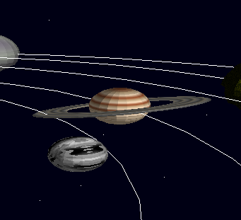

# Outer Wilds from Scratch 🪐
### and also Lab 4 👉👈

[**Watch Demo Here!**](https://youtu.be/f8Rg8hnjJ3g)

## Controls
| **Key**         | **Camera Action**                      |
|-----------------------|---------------------------------|
| `W`          | Camera Up                           |
| `S`          | Camera Down                          |
| `D`          | Camera Right                           |
| `A`          | Camera Left                          |
| `Q`          | Zoom Out                           |
| `E`          | Zoom In                          |
| `B`          | Bird View                          |

| **Key**         | **Subject Action**                      |
|-----------------------|---------------------------------|
| `I`          | Move Front                           |
| `K`          | Move Back                          |
| `L`          | Move Right                           |
| `J`          | Move Left                          |
| `U`          | Move Down                           |
| `O`          | Move Up                          |

## Shaders
| **Sun**        | **Earth**        |
|----------------------|---------------------|
|  |  |
| **Saturn**        | **Pluto <3**        |
|  |  |
| **Crater**        | **Vortex**        |
|  |  |
| **Rivers Planet**        |
|  |